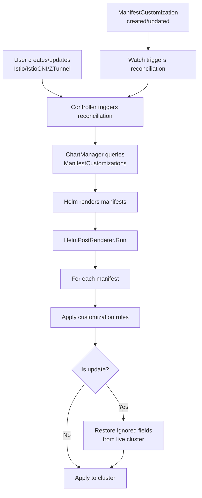

|Status | Authors           | Created    | 
|-------|-------------------|------------|
|WIP    | @bmangoen @skriss | 2025-11-05 |

# Manifest Customization

## Overview
Sail-operator uses Helm to generate and apply manifests to the cluster in response to Istio/IstioCNI/ZTunnel resources being created or updated. 
These manifests are reasonably customizable by the user through the sail-operator CRD specs, which expose the full Helm chart values schema for each resource. 

However, these customizations are limited to what the Helm chart supports and don’t allow arbitrary customizations by the user.  
In addition, Helm itself has some limitations in terms of how it handles reconciling the differences between its generated manifests and the in-cluster state. In particular, Helm does not always gracefully handle cases where an external controller* modifies a Helm-created resource. Typically, this can result in infinite loops where Helm notices a resource it created has been changed and reverts the change, then the external controller* re-applies its modification, then Helm reverts it, and so on. In these scenarios, a user should be able to give Helm “hints” that it should tolerate in-cluster config drift in certain fields and not overwrite them. 

> [!NOTE]  
> "External controller" would be a component outside the Mesh which modifies resources managed by Sail Operator.  

## Goals
The goal of this proposal is to allow users to customize the Helm-generated Kubernetes manifests, as well as how they are applied to the cluster, with fine-grained access control and security considerations, as outlined in Issue #1045: 

* Allow users to prevent specific fields from being overwritten in-cluster
* Enable field overrides across resources
* Support targeting specific resources or resource kinds
* Define different rules for resource creation vs. updates
* Create internal defaults for certain resource configurations


## Non-goals
(None ?)

## Design
We will add a new CRD called `ManifestCustomization`.

### User Stories
1. As a platform engineer, I want my application teams (or maybe personas with more permissions?) 
1. 


### API Changes
We will add a new CRD called `ManifestCustomization` into the experimental API group `x.sailoperator.io`.  

#### ManifestCustomization resource

```yaml
---
apiVersion: apiextensions.k8s.io/v1
kind: CustomResourceDefinition
metadata:
  annotations:
    controller-gen.kubebuilder.io/version: v0.19.0
  name: manifestcustomizations.x.sailoperator.io
spec:
  group: x.sailoperator.io
  names:
    categories:
    - istio-io
    kind: ManifestCustomization
    listKind: ManifestCustomizationList
    plural: manifestcustomizations
    singular: manifestcustomization
  scope: Namespaced
  versions:
  - additionalPrinterColumns:
    - description: The current state of this object
      jsonPath: .status.state
      name: State
      type: string
    - description: The age of the object
      jsonPath: .metadata.creationTimestamp
      name: Age
      type: date
    name: v1alpha1
    schema:
      openAPIV3Schema:
        description: ManifestCustomization is the Schema for the manifestcustomizations
          API
        properties:
          apiVersion:
            description: |-
              APIVersion defines the versioned schema of this representation of an object.
              Servers should convert recognized schemas to the latest internal value, and
              may reject unrecognized values.
              More info: https://git.k8s.io/community/contributors/devel/sig-architecture/api-conventions.md#resources
            type: string
          kind:
            description: |-
              Kind is a string value representing the REST resource this object represents.
              Servers may infer this from the endpoint the client submits requests to.
              Cannot be updated.
              In CamelCase.
              More info: https://git.k8s.io/community/contributors/devel/sig-architecture/api-conventions.md#types-kinds
            type: string
          metadata:
            type: object
          spec:
            description: ManifestCustomizationSpec defines the desired state of ManifestCustomization
            properties:
              rules:
                description: Rules defines a list of customization rules to apply
                  to the matched resources.
                items:
                  description: CustomizationRule defines a rule for customizing matched
                    resources
                  properties:
                    actions:
                      description: |-
                        Actions specifies the list of actions to apply to matched resources.
                        All actions in the list will be applied.
                      items:
                        description: CustomizationAction defines an action to apply
                          to a matched resource
                        properties:
                          field:
                            description: |-
                              Field specifies the field path to which the operation applies.
                              Uses the Istio operator tpath syntax for field path resolution.
                              Examples:
                                - "metadata.labels.foo"
                                - "spec.replicas"
                                - "webhooks[name:my-webhook].namespaceSelector"
                            type: string
                          operation:
                            description: |-
                              Operation specifies the type of operation to perform.
                              Currently only IGNORE is supported.
                            enum:
                            - IGNORE
                            type: string
                        required:
                        - field
                        - operation
                        type: object
                      minItems: 1
                      type: array
                    applyTo:
                      description: |-
                        ApplyTo specifies which resources this rule applies to.
                        A resource matches if it matches ANY of the applyTo criteria.
                      items:
                        description: ResourceMatcher defines criteria for matching
                          Kubernetes resources
                        properties:
                          group:
                            description: |-
                              Group is the API group of the resource (e.g., "apps", "v1", "admissionregistration.k8s.io").
                              Empty string matches the core API group.
                            type: string
                          kind:
                            description: Kind is the kind of the resource (e.g., "Deployment",
                              "ConfigMap", "MutatingWebhookConfiguration").
                            type: string
                          name:
                            description: Name is the name of the resource. Supports
                              wildcards.
                            type: string
                          namespace:
                            description: Namespace is the namespace of the resource.
                              Supports wildcards.
                            type: string
                        required:
                        - kind
                        type: object
                      minItems: 1
                      type: array
                  required:
                  - actions
                  - applyTo
                  type: object
                minItems: 1
                type: array
              targetRefs:
                description: TargetRefs specifies the Istio, IstioCNI, or ZTunnel
                  resources to which this customization applies.
                items:
                  description: TargetRef identifies a target resource to which customizations
                    should be applied
                  properties:
                    kind:
                      description: 'Kind of the target resource. Must be one of: Istio,
                        IstioCNI, ZTunnel'
                      enum:
                      - Istio
                      - IstioCNI
                      - ZTunnel
                      type: string
                    name:
                      description: Name of the target resource
                      type: string
                  required:
                  - kind
                  - name
                  type: object
                minItems: 1
                type: array
            required:
            - rules
            - targetRefs
            type: object
          status:
            description: ManifestCustomizationStatus defines the observed state of
              ManifestCustomization
            properties:
              conditions:
                description: Conditions represents the latest available observations
                  of the object's current state.
                items:
                  description: ManifestCustomizationCondition represents a specific
                    observation of the ManifestCustomization object's state.
                  properties:
                    lastTransitionTime:
                      description: LastTransitionTime is the last time the condition
                        transitioned from one status to another.
                      format: date-time
                      type: string
                    message:
                      description: Message is a human-readable message indicating
                        details about the last transition.
                      type: string
                    reason:
                      description: Reason is a unique, single-word, CamelCase reason
                        for the condition's last transition.
                      type: string
                    status:
                      description: Status is the status of this condition. Can be
                        True, False or Unknown.
                      type: string
                    type:
                      description: Type is the type of this condition.
                      type: string
                  type: object
                type: array
              observedGeneration:
                description: |-
                  ObservedGeneration is the most recent generation observed for this
                  ManifestCustomization object. It corresponds to the object's generation, which is
                  updated on mutation by the API Server.
                format: int64
                type: integer
              state:
                description: State reports the current state of the object.
                type: string
              targetRefStatuses:
                description: TargetRefs contains the status for each target reference
                items:
                  description: TargetRefStatus represents the status of a target reference
                  properties:
                    applied:
                      description: Applied indicates whether the customization has
                        been successfully applied to this target
                      type: boolean
                    kind:
                      description: Kind is the kind of the target resource
                      type: string
                    message:
                      description: Message provides additional information about the
                        status
                      type: string
                    name:
                      description: Name is the name of the target resource
                      type: string
                  required:
                  - applied
                  - kind
                  - name
                  type: object
                type: array
            type: object
        type: object
    served: true
    storage: true
    subresources:
      status: {}
```

Here's an example YAML for the new resource:

```yaml
apiVersion: x.sailoperator.io/v1alpha1
kind: ManifestCustomization
metadata:
  name: ignore-webhooks
  namespace: istio-system
spec:
  targetRefs:
    - kind: Istio
      name: default
  rules:
    - applyTo:
        - group: admissionregistration.k8s.io
          kind: MutatingWebhookConfiguration
          namespace: istio-system
          name: istio-sidecar-injector
      actions:
        - operation: IGNORE
          field: webhook[name:rev.namespace.sidecar-injector.istio.io].namespaceSelector.matchExpressions
```

In the `spec.targetRefs` field, users can specify `Istio`, `IstioCNI` or `ZTunnel` resource that applies customization for.  
The `spec.rules` field lists the customization rules to resources for the given targetRefs.  
A rule has:     
* the `spec.rules.applyTo` field is a list of resource matchers that define which generated resources to apply the customization rule to. 
A resource will be considered matched if it matches ANY of the applyTo rules.  
* the `spec.rules.actions` field defines a list of actions to apply to the matched resources during the specified operations. All actions will be applied.

#### RBAC permissions

The operator should have the same permissions to manage `ManifestCustomization` resource as other operator resources.  

Add the following rules to `chart/templates/rbac/role.yaml`:
```yaml
- apiGroups:
  - x.sailoperator.io
  resources:
  - manifestcustomizations
  verbs:
  - create
  - delete
  - get
  - list
  - patch
  - update
  - watch
- apiGroups:
  - x.sailoperator.io
  resources:
  - manifestcustomizations/finalizers
  verbs:
  - update
- apiGroups:
  - x.sailoperator.io
  resources:
  - manifestcustomizations/status
  verbs:
  - get
  - patch
  - update
```

### Architecture



#### Component Overview

The ManifestCustomization feature consists of two main components:

1. **ManifestCustomization Controller**: Validates ManifestCustomization resources and updates their status
2. **Helm Post-Renderer Integration**: Applies customizations to manifests during Helm chart installation/upgrade

#### Key Components

##### 1. ManifestCustomization Controller
A dedicated controller that manages ManifestCustomization resources:

**Responsibilities:**
- **Validation**: Ensures ManifestCustomization resources have valid configuration
  - Validates that `spec.targetRefs` is not empty
  - Validates that `spec.rules` is not empty
  - Validates that each rule has `applyTo` and `actions` defined
  - Validates that each action has an `operation` and `field` specified
- **Target Reference Verification**: Checks that referenced Istio/IstioCNI/ZTunnel resources exist (stub implementation)
- **Status Management**: Updates `status.conditions`, `status.state`, and `status.targetRefStatuses`

**What it does NOT do:**
- Does not directly apply customizations to cluster resources
- Does not modify manifests or interact with Helm
- Customization application is handled by the Helm post-renderer integration

##### 2. ManifestCustomization CRD
The core Custom Resource Definition that defines customization rules with:
- **TargetRefs**: Specifies which Istio/IstioCNI/ZTunnel resources to apply customizations to
- **Rules**: List of customization rules with matching criteria and actions
- **Status**: Tracks validation state, reconciliation status, and target reference status

##### 3. Resource Matcher
Determines which generated manifests should have customization rules applied:

**Matching Criteria:**
- **Group**: API group (e.g., `apps`, `admissionregistration.k8s.io`, empty for core)
- **Kind**: Resource kind (e.g., `Deployment`, `MutatingWebhookConfiguration`)
- **Namespace**: Target namespace (supports wildcards)
- **Name**: Resource name (supports wildcards via)

**Matching Logic:**
- A manifest matches if it satisfies **ANY** of the `applyTo` criteria (OR logic)
- Empty/unspecified fields in matchers are treated as "match all"
- Wildcard patterns supported for namespace and name (e.g., `istio-*`, `*-injector`)

##### 4. Action Processor
Applies customization actions to matched manifests:

**Operation Types:**
- **IGNORE** (only one implemented): Removes the specified field from the manifest to prevent Helm reconciliation
- **SET**: Override field value completely
- **REMOVE**: Delete a field (and its nested fields)

**Field Path Resolution:**
Uses Istio's [tpath library](https://pkg.go.dev/istio.io/istio/operator/pkg/tpath) for field path resolution, supporting:
- Simple paths: `metadata.labels.app`
- Array selectors: `webhooks[name:my-webhook].namespaceSelector`
- Complex nested paths: `webhooks[name:rev.namespace.sidecar-injector.istio.io].namespaceSelector.matchExpressions`

##### 5. Helm Post-Renderer
The `HelmPostRenderer` implements Helm's `postrender.PostRenderer` interface and is responsible for:

**On Initial Install:**
1. Receives Helm-rendered manifests
2. Adds owner references and managed-by labels
3. Applies ManifestCustomization rules
4. Returns modified manifests to Helm for cluster application

**On Updates:**
1. Receives Helm-rendered manifests
2. Adds owner references and managed-by labels
3. Applies ManifestCustomization rules
4. **Restores ignored fields** from live cluster state to prevent Helm from seeing diffs
5. Returns modified manifests to Helm for cluster application

##### 6. Chart Manager Integration
The `ChartManager` orchestrates the integration:
1. Queries for applicable ManifestCustomizations using the client
2. Creates `HelmPostRenderer` with customizations and client reference
3. Passes post-renderer to Helm install/upgrade actions

##### 7. Watch-Based Orchestration
Controllers for Istio (via IstioRevision), IstioCNI, and ZTunnel resources watch for ManifestCustomization changes:

**Watch Setup (in each controller's `SetupWithManager`):**
```go
Watches(&xv1alpha1.ManifestCustomization{},
    handler.EnqueueRequestsFromMapFunc(r.mapManifestCustomizationToReconcileRequests))
```

**Mapping Function:**
Maps ManifestCustomization changes to target resource reconciliation requests, ensuring that when a ManifestCustomization is created/updated/deleted, the affected Istio/IstioCNI/ZTunnel resources are reconciled immediately.

#### IGNORE Operation Implementation

The IGNORE operation follows a **two-phase approach** to prevent reconciliation loops:

**Phase 1: Remove from manifest (both install and update)**
- Fields marked with IGNORE are removed from the Helm-rendered manifest
- If the field doesn't exist, it's a no-op (no error)

**Phase 2: Restore from live state (update only)**
- After removing ignored fields, the post-renderer fetches the live resource from the cluster
- It extracts the current values of ignored fields
- Values are deep-copied (via JSON marshaling/unmarshaling) to prevent reference corruption
- Values are set back into the manifest
- Result: Helm compares the manifest against the cluster and sees no diff for ignored fields

### Performance Impact
// TODO

### Backward Compatibility
// TODO

### Kubernetes vs OpenShift vs Other Distributions
// TODO

## Alternatives Considered
Other approaches that have been discussed and discarded during or before the creation of the SEP. Should include the reasons why they have not been chosen.
// TODO

## Security Considerations
Certain fields should not be changed otherwise the Sail Operator could be abused for privilege escalation.  
Example: Namespace or Role

## Implementation Plan

### Iteration 1: IGNORE action
Users can set the `IGNORE` action to prevent the field from being updated during reconciliation.
* Add `ManifestCustomization` API
* Implement the new controller
* Integrate to the existing Istio, IstioCNI, ZTunnel controllers

### Iteration 2: SET and REMOVE actions
// TODO

## Test Plan
When and how can this be tested? We'll want to automate testing as much as possible, so we need to start about testability early.

## Change History (only required when making changes after SEP has been accepted)